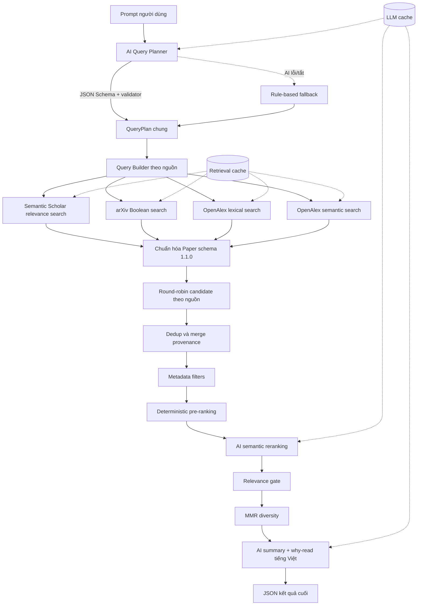

# Kiến trúc tổng thể AI Research Paper Finder

Tài liệu này mô tả kiến trúc hiện tại của pipeline trong `research_pipeline.py`, phiên
bản pipeline `2.2.0` và schema paper `1.1.0`. Mục tiêu là giải thích chính xác dữ liệu
đi qua hệ thống như thế nào, AI tham gia ở đâu, cách ba nguồn được truy vấn, và vì sao
một paper được giữ lại hoặc xếp hạng cao.

## 1. Mục tiêu và phạm vi

Pipeline nhận một yêu cầu nghiên cứu bằng tiếng Việt hoặc tiếng Anh và trả về danh
sách paper:

- liên quan đến đúng chủ đề và ý định tìm kiếm;
- nằm trong các bộ lọc được yêu cầu, ví dụ khoảng năm và open access;
- có tín hiệu chất lượng đủ tốt để ưu tiên đọc;
- hạn chế paper trùng nhau hoặc quá giống nhau;
- có dữ liệu chung ổn định để sau này lưu database;
- có tóm tắt và lý do nên đọc bằng tiếng Việt nếu AI enrichment hoạt động.

Phạm vi hiện tại chỉ lấy metadata và abstract. Pipeline chưa tải PDF, chưa đọc toàn
văn và chưa ghi database.

## 2. Sơ đồ end-to-end



Một cách nhìn ngắn gọn:

```text
Prompt
  -> hiểu nhu cầu
  -> tạo query riêng cho từng nguồn
  -> lấy candidate
  -> chuẩn hóa
  -> lọc trùng
  -> lọc metadata
  -> chấm relevance + quality
  -> AI kiểm tra semantic
  -> loại paper lạc đề
  -> giảm kết quả quá giống nhau
  -> tóm tắt
  -> JSON
```

## 3. Các thành phần chính

| Thành phần | File | Trách nhiệm |
|---|---|---|
| Orchestrator | `research_pipeline.py` | Điều phối toàn bộ stage, chạy ba nguồn song song và tạo output |
| Cấu hình | `config.py` | Limit, trọng số, model, rate limit, cache, profile ranking |
| Query planner | `query_planner.py` | Chuyển prompt thành QueryPlan có cấu trúc |
| Query compiler | `query_builders.py` | Biên dịch QueryPlan thành cú pháp đúng của từng API |
| Source adapters | `semantic_scholar_test.py`, `arxiv_test.py`, `openalex_test.py` | Gọi API và map response về schema chung |
| Chuẩn hóa/HTTP | `common.py` | Chuẩn hóa ngày, DOI, arXiv ID, HTTP retry, lưu JSON |
| Rate limit nguồn | `academic_rate_limiter.py` | Giãn cách mọi request của từng nguồn, thread-safe |
| Dedup | `deduplicator.py` | Gom bản ghi cùng paper và merge metadata/provenance |
| Filter | `filters.py` | Loại retraction, sai năm, thiếu abstract và sai bộ lọc |
| Deterministic rank | `ranker.py` | Tách Query Match và Paper Quality, tạo score giải thích được |
| AI reranker | `ai_reranker.py` | Chấm semantic relevance cho shortlist |
| Relevance gate | `filters.py` | Không cố lấp đủ top-k bằng paper lạc đề |
| Diversity | `diversifier.py` | MMR giảm paper quá giống nhau trong top kết quả |
| AI assessor | `paper_assessor.py` | Tóm tắt, đóng góp và lý do nên đọc bằng tiếng Việt |
| LLM client | `llm_client.py` | JSON contract, schema validation, retry và model fallback |
| Cache | `pipeline_cache.py`, `llm_cache.py` | Giảm số lần gọi API học thuật và LLM |
| Schemas | `*.schema.json` | Hợp đồng dữ liệu cho QueryPlan, paper, rerank và assessment |
| Evaluation | `evaluate_results.py`, `evaluate_benchmark.py`, `audit_quality_suite.py` | Kiểm tra chất lượng và so sánh kết quả |

## 4. Stage 1 — Nhận prompt và lập QueryPlan

Ví dụ prompt:

```text
Tìm paper mới từ năm 2025 về adaptive learning kết hợp automatic quiz generation
```

AI planner không trực tiếp gọi ba nguồn. Nó tạo một biểu diễn trung gian độc lập với
nguồn theo `query_plan.schema.json`:

```json
{
  "research_question": "...",
  "english_question": "...",
  "intent": "latest",
  "ranking_profile": "latest",
  "concept_groups": [
    {
      "concept": "adaptive learning",
      "synonyms": ["personalized learning", "adaptive education"],
      "required": true
    },
    {
      "concept": "automatic quiz generation",
      "synonyms": ["question generation", "quiz generation"],
      "required": true
    }
  ],
  "filters": {
    "year_from": 2025,
    "year_to": null,
    "publication_types": [],
    "open_access_only": false,
    "languages": []
  },
  "query_variants": ["...", "...", "..."]
}
```

### Vai trò của từng field

- `english_question`: câu hỏi chuẩn dùng cho semantic search, AI rerank và assessor.
- `intent`: `exploratory`, `evidence_review`, `latest`, `seminal` hoặc `comparison`.
- `ranking_profile`: chọn bộ trọng số `balanced`, `latest`, `seminal` hoặc
  `evidence_review`.
- `concept_groups`: các cụm khái niệm và từ đồng nghĩa.
- `required=true`: paper phải thể hiện khái niệm này, trừ khi AI reranker đưa ra bằng
  chứng semantic đủ mạnh.
- `filters`: constraint cứng như năm, loại publication, open access và ngôn ngữ.
- `query_variants`: tối đa ba câu query tiếng Anh; hiện được dùng trực tiếp cho
  Semantic Scholar.

Sau AI, `validate_query_plan()` làm sạch array, enum, năm và giới hạn số phần tử.
`_apply_prompt_constraints()` còn bắt lại các yêu cầu năm rõ ràng trong prompt để tránh
model nhỏ hiểu sai `từ năm 2025` thành đúng riêng năm 2025.

Nếu tắt AI, thiếu key hoặc AI thất bại, planner rule-based tạo QueryPlan tối thiểu từ
prompt ban đầu. Pipeline vẫn chạy, nhưng query expansion và hiểu semantic sẽ yếu hơn.

## 5. Stage 2 — Biên dịch query cho ba nguồn

Pipeline không gửi cùng một chuỗi URL cho cả ba nguồn. `query_builders.py` chuyển
QueryPlan chung thành cú pháp phù hợp từng API.

| Nguồn | Số query thông thường | Cơ chế hiện tại | Thứ tự API |
|---|---:|---|---|
| Semantic Scholar | Tối đa 3 | Mỗi `query_variant` là một relevance query riêng | Relevance của Semantic Scholar |
| arXiv | 1 | Một biểu thức Boolean ghép required concepts và synonym | `sortBy=relevance` giảm dần |
| OpenAlex | 2 | Một lexical query và một semantic query | `relevance_score:desc` |

### Semantic Scholar

Mỗi query variant được gửi riêng đến endpoint paper search. Các filter có thể gồm:

- `publicationDateOrYear=start:end`;
- `publicationTypes=...`;
- `openAccessPdf` khi chỉ lấy open access.

Query được làm phẳng, bỏ gạch nối vì relevance search của Semantic Scholar không dùng
cú pháp Boolean phức tạp trong nhánh này.

### arXiv

Các synonym trong cùng concept được ghép `OR`, còn các concept bắt buộc được ghép
`AND`. Khoảng năm được đẩy vào `submittedDate`.

Ví dụ dạng biểu thức:

```text
(all:"adaptive learning" OR all:"personalized learning")
AND (all:"quiz generation" OR all:"question generation")
AND submittedDate:[202501010000 TO 210012312359]
```

arXiv chỉ được gọi một lần cho plan vì query Boolean đã chứa nhiều concept/synonym.

### OpenAlex

OpenAlex chạy hai nhánh:

1. `search`: lexical query ghép required concepts bằng Boolean.
2. `search.semantic`: dùng toàn bộ `english_question` để bắt quan hệ ngữ nghĩa mà
   keyword exact có thể bỏ sót.

Hai nhánh đều có filter `has_abstract:true`, khoảng năm, language và open access nếu
được yêu cầu. Semantic request bị giới hạn tối đa 50 paper trong code.

### Tìm “mới nhất” thực sự hoạt động thế nào

Các request vẫn ưu tiên **relevance**, không đổi sang sort ngày. Độ mới được đảm bảo
bằng ba lớp:

1. filter `year_from/year_to` được đẩy xuống API khi nguồn hỗ trợ;
2. filter deterministic kiểm tra lại năm sau khi merge;
3. profile `latest` tăng mạnh trọng số recency khi xếp hạng.

Cách này tốt hơn việc chỉ sort ngày vì một paper rất mới nhưng không liên quan sẽ
không tự động đứng đầu.

## 6. Stage 3 — Retrieval song song, cache và adaptive retrieval

Ba nguồn được chạy song song bằng ba worker. Bên trong từng nguồn, các query vẫn chạy
tuần tự để giữ rate limit.

```text
Thread 1: Semantic Scholar query 1 -> query 2 -> query 3
Thread 2: arXiv Boolean query
Thread 3: OpenAlex lexical -> semantic
```

Trước mỗi call, pipeline kiểm tra retrieval cache theo:

```text
source + query spec + filters + limit
```

TTL hiện tại:

- Semantic Scholar: 6 giờ;
- OpenAlex: 6 giờ;
- arXiv: 24 giờ.

`--no-cache` buộc gọi lại API, phù hợp khi cần paper mới nhất vừa được index.

### Adaptive retrieval

Pipeline không nhất thiết chạy hết mọi query expansion. Sau số request tối thiểu của
từng nguồn, nó có thể dừng sớm khi:

- đã đạt ít nhất 60% `source_cap`; hoặc
- request vừa rồi tạo dưới 10% candidate mới.

Minimum request hiện tại:

- Semantic Scholar: 2;
- OpenAlex: 2;
- arXiv: 1.

Mục tiêu là giảm quota và latency khi query tiếp theo chủ yếu trả lại paper đã thấy.
Dùng `--no-adaptive-retrieval` nếu muốn ép chạy toàn bộ query.

### Phân bổ candidate công bằng

Sau retrieval, các bucket nguồn được ghép round-robin thay vì nối toàn bộ một nguồn
trước. Nhờ đó `max_candidates` không dễ bị một API chiếm hết. Sau đó `source_cap` và
`max_candidates` giới hạn kích thước trước dedup.

## 7. Stage 4 — Rate limit, retry và lỗi nguồn

Mọi HTTP attempt đến nguồn học thuật đều đặt chỗ qua limiter thread-safe. Khoảng cách
thực tế hiện tại là base cộng safety margin:

| Nguồn | Base | Margin | Khoảng tối thiểu thực tế |
|---|---:|---:|---:|
| Semantic Scholar | 1.0 giây | 0.5 giây | 1.5 giây |
| arXiv | 3.0 giây | 0.5 giây | 3.5 giây |
| OpenAlex | 1.0 giây | 0.5 giây | 1.5 giây |

Các mã `429`, `500`, `502`, `503`, `504` và lỗi mạng được retry. Mỗi request có tối
đa hai attempt: lần đầu và đúng một retry. Delay ưu tiên header `Retry-After`; nếu
không có thì dùng exponential backoff cộng 0.5 giây margin, tối đa 90 giây.

Lỗi của một nguồn không làm mất kết quả của hai nguồn còn lại. Metadata output ghi
request nào lỗi, request nào lấy từ cache, elapsed time và số paper trả về.

## 8. Stage 5 — Chuẩn hóa về schema chung

Mỗi adapter chuyển response khác nhau về `paper.schema.json`. Các field ổn định gồm:

```text
schema_version, source, source_id, source_rank,
title, abstract, authors,
year, published_at, updated_at,
venue, doi, arxiv_id,
url, pdf_url,
citation_count, reference_count, is_open_access,
fields, publication_types, source_specific
```

### Quy tắc chuẩn hóa quan trọng

- `published_at` và `updated_at` luôn là `YYYY-MM-DD`, quy đổi theo lịch Việt Nam nếu
  đầu vào có timezone; không lưu giờ/phút/giây trong paper schema.
- DOI được bỏ prefix `doi:` hoặc `https://doi.org/` và chuyển lowercase.
- arXiv ID được bỏ URL, `.pdf` và version như `v2`.
- whitespace trong title/abstract được thu gọn.
- abstract inverted index của OpenAlex được dựng lại thành văn bản.
- `None`, string/list/object rỗng trong `source_specific` được bỏ; `false` và `0` vẫn
  được giữ.
- Field riêng của nguồn nằm trong `source_specific`; field chung không phụ thuộc API.

`source_specific.raw_data`/`raw_atom` đang được giữ vì
`PRESERVE_RAW_SOURCE_DATA=True`, hữu ích để audit nhưng có thể làm JSON lớn. Khi đưa
vào database, phần field chung có thể thành column ổn định và `source_specific` thành
JSON/JSONB.

### URL và PDF

- `url` là landing page hoặc trang paper.
- `pdf_url` ưu tiên direct PDF nếu API cung cấp.
- Semantic Scholar có thể fallback sang `/reader/{paperId}`; đây là reader HTML,
  không được coi là direct PDF.
- Nếu paper có arXiv ID, adapter có thể lưu direct arXiv PDF riêng trong provenance.

## 9. Stage 6 — Dedup và merge metadata

Dedup dùng nhiều tầng thay vì chỉ so title:

1. exact `source + source_id`;
2. DOI đã chuẩn hóa;
3. arXiv ID;
4. PMID, PMCID, MAG, DBLP, ACL và Semantic Scholar Corpus ID;
5. fuzzy title + author đầu + cửa sổ năm.

Với persistent ID, title similarity tối thiểu 0.78 và năm lệch không quá hai năm.
Nếu không có ID chung, fuzzy match bảo thủ hơn với threshold 0.94. Author đầu phải
tương thích, trừ trường hợp title gần như giống tuyệt đối.

Khi nhiều record được gom lại, pipeline:

- chọn record nền ưu tiên publication đã xuất bản, venue thật, DOI, abstract dài và
  direct PDF;
- lấy abstract dài nhất trong các record tương thích;
- ưu tiên DOI xuất bản hơn DOI dẫn xuất của arXiv;
- lấy citation/reference count lớn nhất nhưng vẫn giữ count theo từng nguồn;
- hợp nhất fields, publication types, URL truy cập và provenance;
- giữ mọi retrieval hit để ranking biết paper xuất hiện ở nguồn/query/rank nào.

`dedup_key` ưu tiên `doi:...`, sau đó `arxiv:...`, cuối cùng là SHA-1 rút gọn của title.

## 10. Stage 7 — Deterministic metadata filter

Sau dedup, paper có thể bị loại vì:

- `retracted`;
- thiếu abstract khi `require_abstract=true`;
- trước `year_from` hoặc sau `year_to`;
- không open access khi prompt yêu cầu;
- publication type không khớp;
- language được biết rõ và không khớp.

Một số filter xử lý bảo thủ: nếu nguồn không biết year, type hoặc language thì paper
không bị loại chỉ vì metadata đó thiếu. Lý do loại được ghi trong mảng `rejected`.

## 11. Stage 8 — Deterministic pre-ranking

Ranking cố ý tách hai câu hỏi khác nhau:

1. **Query Match**: paper có đúng thứ người dùng hỏi không?
2. **Paper Quality**: paper có tín hiệu đáng ưu tiên đọc không?

### 11.1 Source rank fusion

Với mỗi nguồn, chỉ best rank của paper được dùng cho RRF:

```text
rank_score = (RRF_K + 1) / (RRF_K + best_rank)
RRF_K = 60
```

Sau đó lấy trung bình có trọng số giữa các nguồn. Ba nguồn mặc định có trọng số bằng
nhau. Việc một paper xuất hiện trong nhiều query của cùng nguồn không nhân citation
giả; số query trúng được đưa riêng vào `query_coverage`.

### 11.2 Text match

`text_match` gồm:

```text
50% concept coverage
30% title token coverage
20% abstract token coverage
```

Required concept có trọng số 1.0; optional concept có trọng số 0.35. Pipeline còn lưu
riêng `required_concept_coverage` để relevance gate sử dụng.

### 11.3 Query Match tổng

Mặc định:

```text
QueryMatch = 45% source RRF
           + 45% text match
           + 10% query coverage
```

### 11.4 Paper Quality

Paper Quality được tổng hợp từ:

- impact: citation count, normalized citation percentile, FWCI và influential
  citations;
- citation velocity trong ba năm gần nhất;
- recency theo exponential half-life;
- publication type;
- khả năng truy cập direct PDF/open access;
- source agreement với bonus rất nhỏ;
- metadata completeness.

Citation count và related count được log-normalize trong tập candidate để paper cực
nhiều citation không áp đảo tuyến tính. FWCI được map bằng `fwci / (fwci + 1)`.
Recency dùng:

```text
recency = exp(-ln(2) * age / half_life)
```

Half-life theo profile:

| Profile | Half-life |
|---|---:|
| `latest` | 1.5 năm |
| `balanced` | 5 năm |
| `evidence_review` | 6 năm |
| `seminal` | 12 năm |

### 11.5 Điểm deterministic cuối

| Profile | Query Match | Paper Quality | Ý nghĩa |
|---|---:|---:|---|
| `balanced` | 0.60 | 0.40 | Cân bằng relevance và chất lượng |
| `latest` | 0.55 | 0.45 | Quality bên trong đặt recency 0.45 |
| `seminal` | 0.50 | 0.50 | Quality bên trong đặt impact 0.50 |
| `evidence_review` | 0.55 | 0.45 | Ưu tiên review/publication/completeness |

Mọi phép weighted average tự normalize theo tín hiệu hiện có, nên không bắt buộc các
mapping trọng số cộng chính xác bằng 1.

## 12. Stage 9 — AI reranking

Chỉ top `ai_rerank_limit` sau deterministic rank được gửi AI theo batch. AI chỉ thấy:

- research question và intent;
- required/preferred concepts;
- `paper_id`, title và một phần abstract.

AI cố ý không thấy citation count và venue để tránh lặp lại prestige/impact bias đã
được xử lý ở Paper Quality. Nó trả:

```text
relevance, intent_match, method_match, confidence,
read_priority, matched_concepts, reason
```

AI signal:

```text
AISignal = 55% relevance + 30% intent_match + 15% method_match
```

AI không thay Paper Quality. Nó chỉ điều chỉnh Query Match:

```text
effective_weight = AI_RERANK_WEIGHT * confidence
adjusted_query_match =
    (1 - effective_weight) * deterministic_query_match
    + effective_weight * AISignal
```

`AI_RERANK_WEIGHT` hiện là 0.25. Nếu confidence dưới 0.30, AI bị bỏ qua. Nếu nhiều
batch phải dùng model khác nhau, trọng số AI bị nhân penalty 0.50 vì điểm giữa model
khác nhau không hoàn toàn calibration-compatible.

Cuối cùng recommendation score được tính lại bằng adjusted Query Match và Paper
Quality theo profile ban đầu.

## 13. Stage 10 — Relevance gate

Pipeline không đảm bảo luôn trả đủ `result_limit`. Đây là chủ ý: top 20 paper tốt hơn
không có nghĩa phải lấp bằng paper lạc đề.

Paper bị loại nếu một trong các điều kiện sau đúng:

1. thiếu required concept, trừ khi AI có relevance từ 0.70 và confidence từ 0.60;
2. AI confidence từ 0.60 nhưng AI relevance dưới 0.25;
3. text match dưới 0.10 và cũng không có AI relevance đủ 0.25.

Lý do lần lượt là `missing_required_concept`, `ai_high_confidence_irrelevant` và
`insufficient_relevance_evidence`.

## 14. Stage 11 — Diversity bằng MMR

Sau relevance gate, greedy MMR chọn kết quả từ pool tối đa 30 paper:

```text
MMR = lambda * normalized_recommendation_score
      - (1 - lambda) * max_similarity_to_selected
```

`lambda=0.82`, nên relevance vẫn chiếm ưu thế nhưng paper có title/abstract quá giống
paper đã chọn sẽ bị trừ điểm. Similarity hiện dùng Jaccard token, không dùng embedding.
`--no-diversity` trả top-k theo recommendation score thuần.

## 15. Stage 12 — AI enrichment tiếng Việt

Top `ai_enrich_limit` trong danh sách cuối được gửi AI theo batch. Mặc định mỗi batch
có năm paper. AI chỉ dựa trên title, abstract và publication type để tạo:

- `summary`: tối đa hai câu ngắn;
- `main_contribution`: một câu;
- `why_read`: một câu gắn với research question;
- `paper_type`;
- tối đa bốn `tags`;
- `evidence_strength`;
- tối đa hai limitation nhìn thấy từ abstract;
- `confidence`.

Các nội dung mô tả phải bằng tiếng Việt có dấu. Validator từ chối output tiếng Anh,
thiếu paper, trùng ID, sai range hoặc sai schema. Vì chưa đọc PDF, mọi đánh giá có
`evidence_scope="abstract"`; hệ thống không được khẳng định những gì abstract không
nói.

Paper cuối không được AI enrichment vẫn có `search_analysis` từ AI reranker hoặc
deterministic fallback, nhưng `paper_analysis` sẽ là `null`.

## 16. Hợp đồng output AI, retry và model fallback

Cả query planner, reranker và assessor dùng cùng một `MANDATORY OUTPUT CONTRACT`:

- chỉ một JSON object, không Markdown/code fence/prose;
- đúng exact JSON Schema;
- đủ required field và đúng JSON type;
- không thêm field ngoài schema;
- đúng enum, range và giới hạn array;
- copy mỗi `paper_id` đúng một lần;
- không bịa dữ kiện khi evidence thiếu.

Các lớp bảo vệ theo thứ tự:

```text
Prompt contract
  -> provider structured output/tool calling
  -> parse JSON
  -> task-specific validator
  -> retry sửa output đúng 1 lần
  -> chuyển model fallback
  -> deterministic fallback/degraded status
```

Với Groq, model hỗ trợ strict JSON Schema nhận `response_format=json_schema`; model
khác nhận `json_object`. Với OpenRouter, client dùng function/tool schema. Vì prompt
không thể ép tuyệt đối mọi model tuân thủ, validator mới là ranh giới tin cậy cuối.

Mỗi model có tối đa hai attempt: lần đầu và một retry. Chỉ sau đó mới chuyển sang model
tiếp theo trong danh sách. LLM cache identity bao gồm provider, models, prompt, schema,
contract, input và giới hạn token nên thay contract sẽ không dùng nhầm cache cũ.

## 17. Groq/OpenRouter và kiểm soát quota AI

Groq là provider mặc định. Model được chọn riêng theo task trong `GROQ_TASK_MODELS`:

- planner ưu tiên `openai/gpt-oss-20b`;
- reranker ưu tiên `qwen/qwen3.6-27b`;
- assessor ưu tiên `openai/gpt-oss-20b`.

Client giữ mức sử dụng mục tiêu 80% RPM/TPM/RPD/TPD, ước tính token trước request và
đọc rate-limit headers sau response. Batch size và completion token cap được đặt riêng
theo task/model.

OpenRouter vẫn là provider thay thế khi đặt `LLM_PROVIDER=openrouter`. Nó khám phá
model free phù hợp và chuyển model nếu model hiện tại lỗi hoặc không trả cấu trúc hợp
lệ.

## 18. Cấu trúc JSON output cuối

Các object cấp cao:

| Field | Nội dung |
|---|---|
| `pipeline_version`, `paper_schema_version` | Version để migration/reproducibility |
| `status` | `success`, `partial_success` hoặc `failed` |
| `prompt`, `created_at`, `elapsed_seconds` | Input và thời gian chạy |
| `timings_seconds` | Thời gian từng stage |
| `runtime_config` | Limit, rate limit và toàn bộ trọng số ranking đã dùng |
| `query_plan` | Cách hệ thống hiểu prompt |
| `planner` | Model, fallback, cache và token usage |
| `source_queries` | Query thực tế gửi từng nguồn |
| `retrieval` | Count, request log, errors và adaptive stop reason |
| `metrics` | Duplicate rate, rejection rate, lỗi nguồn, token/cost |
| `rejected` | Paper bị loại và lý do |
| `ai_reranker`, `assessor` | Metadata AI theo batch/model |
| `stage_rankings` | ID theo từng tầng để audit/ablation |
| `papers` | Danh sách paper cuối |

Mỗi item trong `papers` gồm paper đã merge, deterministic score, recommendation score,
score breakdown, retrieval provenance, rank trước/sau AI/diversity và assessment.

`status` được xác định như sau:

- `failed`: cả ba nguồn đều thất bại;
- `partial_success`: có source error hoặc một AI component bị degraded/incomplete;
- `success`: retrieval và các AI component được yêu cầu đều hoàn tất.

## 19. Các tham số kiểm soát kích thước pipeline

Các limit là những tầng khác nhau, không nên hiểu là cùng một giá trị:

```text
paper/request
  -> source_cap
  -> max_candidates
  -> deduplicated + filtered
  -> pre_rank_limit
  -> ai_rerank_limit
  -> relevance gate
  -> result_limit
  -> ai_enrich_limit
```

Preset `quick` hiện tại:

```text
S2 15/query, arXiv 40/query,
OpenAlex lexical 20/query, semantic 20/query,
max 120 candidate -> 30 pre-rank -> 20 AI rerank -> tối đa 10 kết quả.
```

Preset `standard`:

```text
S2 40/query, arXiv 100/query,
OpenAlex lexical 50/query, semantic 50/query,
max 250 candidate -> 80 pre-rank -> 30 AI rerank -> tối đa 15 kết quả.
```

Muốn lấy tối đa 20 paper cuối và enrichment đủ 20 paper:

```powershell
python test/test-ai-research-tool/research_pipeline.py `
  "Tìm paper mới về deepfake detection" `
  --search-depth standard `
  --latest-years 2 `
  --pre-rank-limit 80 `
  --ai-rerank-limit 40 `
  --result-limit 20 `
  --ai-enrich-limit 20 `
  --output test/test-ai-research-tool/results/deepfake_latest.json
```

Kết quả thực tế có thể ít hơn 20 nếu nguồn trả ít candidate, filter loại nhiều paper
hoặc relevance gate xác định các paper còn lại không đủ liên quan.

## 20. Điểm cấu hình chính

Sửa trong `config.py` khi muốn thay default toàn hệ thống:

- `SEARCH_DEPTH_PRESETS`: kích thước từng tầng;
- `MAX_QUERY_VARIANTS`, `MAX_TERMS_PER_CONCEPT`: độ rộng query expansion;
- `SOURCE_REQUEST_INTERVAL_SECONDS`, `SOURCE_RATE_LIMIT_SAFETY_MARGIN_SECONDS`;
- `QUERY_MATCH_WEIGHTS`, `TEXT_MATCH_WEIGHTS`;
- `FINAL_SCORE_WEIGHTS`, `PAPER_QUALITY_WEIGHTS`;
- `IMPACT_SIGNAL_WEIGHTS`, `RECENCY_HALF_LIFE_YEARS`;
- `AI_RERANK_WEIGHT`, `AI_RERANK_SIGNAL_WEIGHTS`;
- các threshold của relevance gate;
- `DIVERSITY_LAMBDA`;
- batch size, model list, token cap và quota Groq;
- TTL retrieval/LLM cache;
- `REQUEST_ATTEMPTS=2`, `LLM_ATTEMPTS=2`.

Ưu tiên CLI khi chỉ thay cho một lần chạy; sửa `config.py` khi muốn đổi chính sách mặc
định. `runtime_config` trong mỗi output lưu snapshot trọng số thực tế để kết quả có thể
được giải thích và tái lập.

## 21. API key và dữ liệu nhạy cảm

`.env` có thể chứa:

```dotenv
SEMANTIC_SCHOLAR_API_KEY=
OPENALEX_API_KEY=
OPENALEX_MAILTO=
ARXIV_CONTACT_EMAIL=
LLM_PROVIDER=groq
GROQ_API_KEY=
OPENROUTER_API_KEY=
```

arXiv không cần key. Email là tùy chọn để nhận diện client lịch sự. Key không được đưa
vào cache identity, JSON output hay error log.

## 22. Observability và kiểm chứng chất lượng

Output giữ đủ bằng chứng để debug một kết quả:

- query plan và query gửi từng nguồn;
- source rank/query hit/provenance;
- số candidate qua từng tầng;
- lý do reject;
- score breakdown và exact ranking config;
- thứ hạng RRF-only, query-only, deterministic, AI và diversified;
- model đã thử, model thành công, cache, usage và lỗi từng batch;
- elapsed time từng stage và source request.

Các script đánh giá hỗ trợ hai mức:

- smoke/unit: kiểm tra parser, schema, dedup, ranking, retry và invariant;
- benchmark có label: đánh giá relevance/ranking với ground truth do người dùng gán.

Không nên kết luận “ranking tối ưu” chỉ từ việc pipeline chạy không lỗi. Chất lượng cần
được theo dõi bằng benchmark nhiều chủ đề với các metric như precision@k, recall@k,
nDCG/MRR, duplicate rate và tỷ lệ false positive của relevance gate.

## 23. Giới hạn kiến trúc hiện tại

- Search phụ thuộc coverage/index freshness của ba nguồn; paper mới có thể chưa được
  index đồng thời.
- Citation thiên về paper cũ; profile `latest` giảm nhưng không xóa hoàn toàn bias.
- AI chỉ đọc abstract, nên summary và why-read không thay thế review toàn văn.
- MMR dùng token Jaccard, chưa hiểu semantic similarity sâu.
- Fuzzy dedup có thể bỏ sót title thay đổi lớn hoặc merge nhầm title gần giống.
- Score giữa hai lần chạy có thể đổi khi candidate pool/citation metadata thay đổi.
- Unknown year/language/type hiện được giữ theo hướng recall-first.
- Pipeline chưa có persistence layer, queue/job system, tracing tập trung hoặc PDF
  ingestion.

## 24. Ranh giới kiến trúc để mở rộng sau này

Các bước mở rộng có thể thêm mà không phá pipeline hiện tại:

```text
API/UI
  -> Job queue
  -> Pipeline hiện tại
  -> Paper table + SourceRecord JSONB + SearchRun/Audit tables
  -> PDF fetcher riêng
  -> full-text chunking/citation-grounded summarizer
```

Nên giữ retrieval/ranking và PDF processing thành hai pipeline riêng. Metadata search
cần nhanh, rộng và có thể retry; PDF processing chậm, tốn tài nguyên và có vấn đề
license/access khác. Schema chung `paper 1.1.0`, `dedup_key` và provenance là điểm nối
phù hợp giữa hai phần.

## 25. Tóm tắt vai trò của AI

AI được dùng đúng ba nơi:

1. **Planner** — hiểu prompt, dịch/chuẩn hóa ý định, sinh concept và query variants.
2. **Reranker** — kiểm tra semantic relevance của shortlist từ title/abstract.
3. **Assessor** — tóm tắt và giải thích bằng tiếng Việt vì sao nên đọc.

AI không trực tiếp quyết định toàn bộ ranking, không tự tạo citation/quality score,
không dedup, không áp dụng filter cứng và không điều khiển rate limit. Các phần đó là
deterministic để dễ kiểm tra, cấu hình và tái lập.
